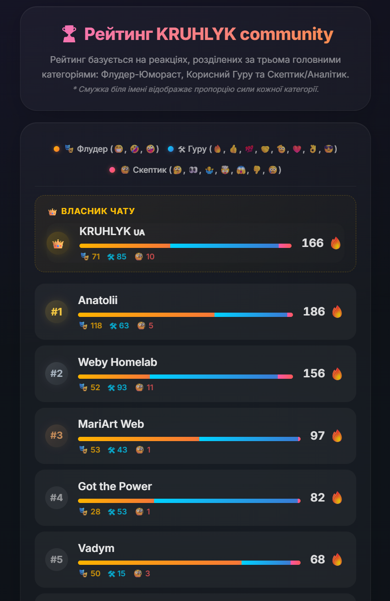
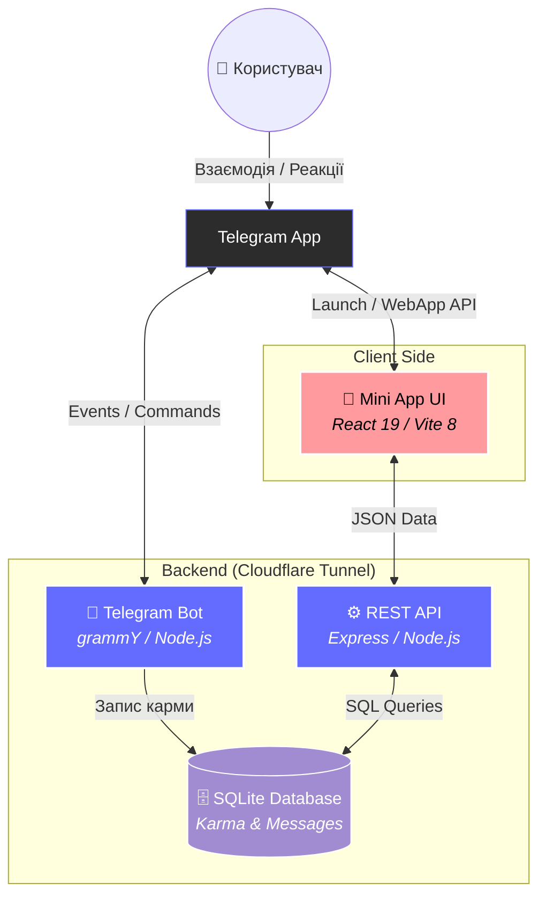
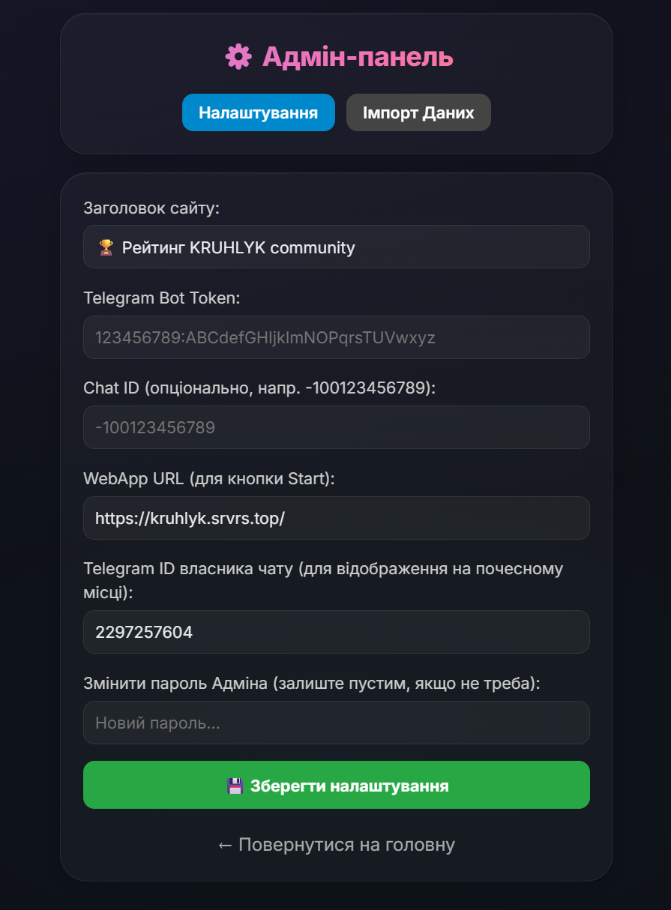

# Karma Community App 🏆 (BARE METAL Edition)

<p align="center">
  
</p>

Сучасний Telegram Mini App для гейміфікації спільноти. Оцінка активності базується на реакціях, розділених за трьома психологічними лінзами (Флудер-Юмораст, Корисний Гуру та Скептик/Аналітик) з візуалізацією у вигляді кольорових лінійних діаграм (stacked bar charts) та легендою рейтингу. Ця версія оптимізована для класичного запуску на "голому залізі" (bare-metal) без Docker.

  

## 🏗️ Архітектура Системи



---

## 🌟 Можливості (Features)

*   **Три лінзи карми (Reaction Lenses):** Реакції розділено на три ключові категорії: Флудер-Юмораст (меми/активність), Корисний Гуру (Docker/сервери/досвід) та Скептик/Аналітик (ризики/баги).
*   **Кольорові лінійні діаграми:** Stacked Bar Charts у рядку кожного учасника відображають процентне співвідношення категорій його карми разом із абсолютними лічильниками.
*   **Легенда рейтингу:** Зручна та інформативна легенда у голові рейтингової таблиці.
*   **Легкий онбординг:** Зручний інтерфейс покрокового підключення бота та імпорту історії повідомлень (через експорт JSON з Telegram Desktop) для нових інстансів.
*   **Тиха Гейміфікація:** Карма нараховується виключно за емодзі-реакції на повідомлення. Ніякого текстового спаму типу "+1 до карми" у чатах!
*   **Гарний Інтерфейс (Glassmorphism):** Сучасний, адаптивний дизайн, розроблений за концепцією Glassmorphism (v3.4.1), ідеально виглядає у світлій та темній темах Telegram.
*   **Інтеграція з Telegram Web App:** Нативний досвід користувача прямо всередині месенджера. Запуск через кнопку `Menu Button`.
*   **Real-time оновлення бази:** SQLite база миттєво фіксує всі змінені та видалені реакції. Бот рахує дельту та забезпечує справедливу карму.
*   **Безпека та CORS:** Бекенд приховано за проксі від Vite (Node.js/Express) для безперебійної роботи через один публічний домен (`winner.srvrs.top`).

## 📂 Структура Проєкту

Для детальної інформації про кожну частину додатка, зверніться до відповідних розділів:
- [**Backend Documentation**](./backend/README.md) ⚙️ — логіка бота, API та база даних.
- [**Frontend Documentation**](./frontend/README.md) 🎨 — інтерфейс, дизайн та інтеграція з Mini App.

## 🛠️ Стек Технологій

**Frontend:**
*   React 19 + Vite 8
*   Glassmorphism v3.4.1 (Custom CSS)
*   Telegram Web App API

**Backend:**
*   Node.js + Express.js
*   grammY (Modern Bot Framework)
*   SQLite3 (Embedded Database)

## 🚀 Встановлення та Запуск

1.  **Клонування репозиторію:**
    ```bash
    git clone https://github.com/weby-homelab/karma-community-app.git
    cd karma-community-app
    ```

2.  **Налаштування бекенду:**
    ```bash
    cd backend
    npm install
    # Створіть файл .env:
    echo "BOT_TOKEN=Ваш_Telegram_Бот_Токен" > .env
    echo "PORT=3015" >> .env
    # Запустіть бекенд:
    node server.js
    ```

3.  **Налаштування фронтенду:**
    ```bash
    cd ../frontend
    npm install
    # Для розробки:
    npm run dev -- --host
    # Для продакшену:
    npm run build
    ```

4.  **Підключення бота в Telegram:**
    *   Додайте свого бота (наприклад, `@Monitor_DRivers_bot`) як адміністратора до вашої супергрупи.
    *   Налаштуйте `Menu Button` через `@BotFather`, щоб він відкривав вашу веб-адресу з фронтендом.

## ⚙️ Адмін-панель
Налаштування додатка зручно здійснюється через вбудовану адмін-панель за адресою `/admin`.



**Доступні налаштування:**
*   **Заголовок сайту:** 🏆 Рейтинг KRUHLYK Community
*   **Telegram Bot Token:** `123456789:ABCdefGHIjklmNOPqrsTUVwxyz`
*   **Chat ID (опціонально, напр. -100123456789):** `-100123456789`
*   **WebApp URL (для кнопки Start):** `https://kruhlyk.srvrs.top/`
*   **Змінити пароль Адміна:** (залиште пустим, якщо не треба)
*   **Імпорт Даних:** Можливість завантажити бекап карми у JSON-форматі.

## 🤝 Контриб'ютори
Будь-які Pull Requests (PR) дуже вітаються! Створюйте Issue, якщо знаходите баги або хочете додати новий функціонал. 

## 📄 Ліцензія
[MIT License](LICENSE)

<br>
<p align="center">
  Built in Ukraine under air raid sirens &amp; blackouts ⚡<br>
  &copy; 2026 Weby Homelab
</p>
