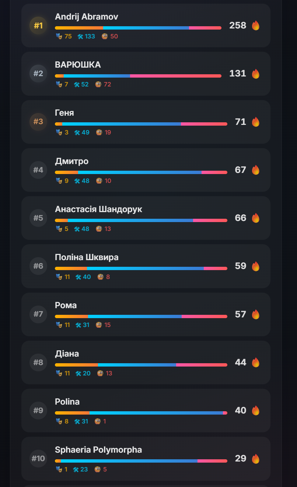
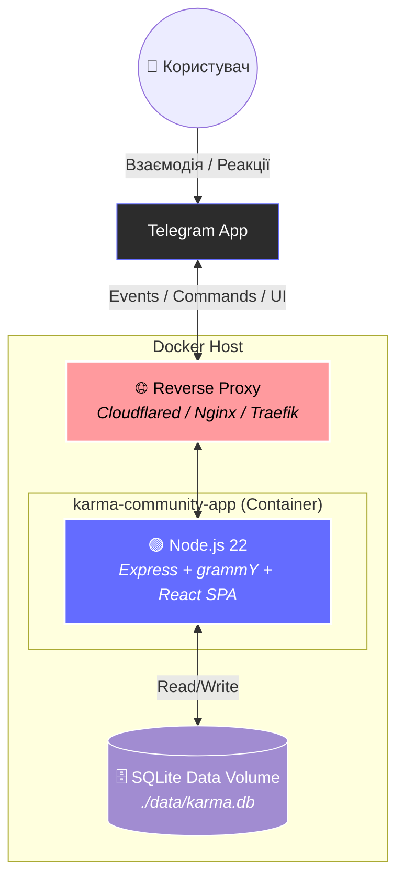
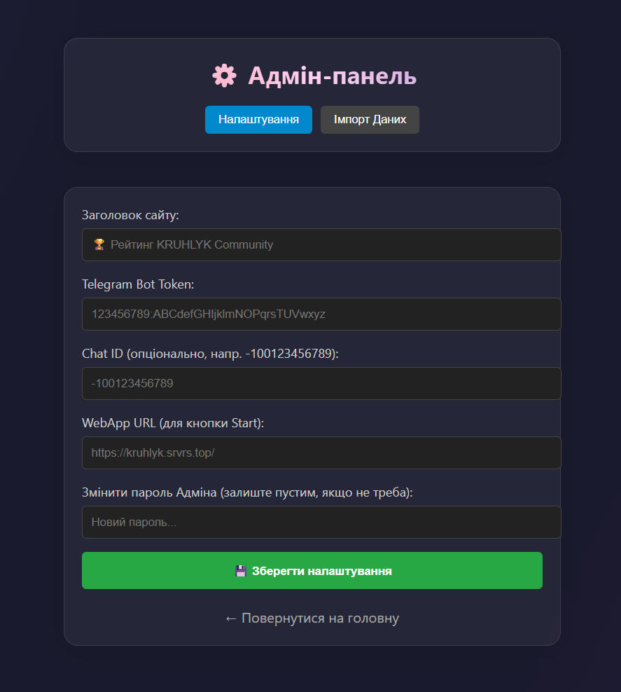

# Karma Community App 🏆 (Docker Edition)

<p align="center">
  
</p>

Сучасний Telegram Mini App для гейміфікації спільноти. Ця версія оптимізована для роботи в **Docker**-середовищі, підтримує легке горизонтальне масштабування (multi-tenancy) та віддачу статичного React-застосунку прямо через вбудований Node.js сервер.

  

## 🏗️ Архітектура Системи (Docker)



---

## 🌟 Можливості (Features)

*   **Тиха Гейміфікація:** Карма нараховується виключно за емодзі-реакції на повідомлення.
*   **Docker-First:** Один надлегкий образ на базі Alpine/Debian slim, який містить в собі як Telegram-бота, так і зібраний Frontend.
*   **Мульти-інстанс:** Легко запускайте 3, 5 або 10 копій ботів для різних спільнот на одному сервері через єдиний `docker-compose.yml`.
*   **Гарний Інтерфейс (Glassmorphism):** Сучасний, адаптивний дизайн.

## 🚀 Швидкий старт (Docker Compose)

Найпростіший спосіб розгорнути додаток:

1.  **Створіть робочу директорію:**
    ```bash
    mkdir karma-app && cd karma-app
    ```

2.  **Створіть `docker-compose.yml`:**
    ```yaml
    version: '3.8'
    services:
      karma-bot:
        image: webyhomelab/karma-community-app:latest
        container_name: karma-bot
        restart: unless-stopped
        ports:
          - "3015:3000"
        environment:
          - BOT_TOKEN=Ваш_Telegram_Бот_Токен
          - DB_PATH=/app/backend/data/karma.db
        volumes:
          - ./data:/app/backend/data
    ```

3.  **Запустіть:**
    ```bash
    docker compose up -d
    ```
Додаток буде доступний на порту 3015. Всі дані надійно зберігаються у папці `./data/`.

Для класичного запуску на "голому залізі" (bare-metal) без Docker, використовуйте гілку `classic`.

## ⚙️ Адмін-панель
Налаштування додатка зручно здійснюється через вбудовану адмін-панель за адресою `/admin`.



**Доступні налаштування:**
*   **Заголовок сайту:** (напр. *🏆 Рейтинг KRUHLYK Community*)
*   **Telegram Bot Token:** `123456789:ABCdefGHIjklmNOPqrsTUVwxyz`
*   **Chat ID (опціонально):** `-100123456789`
*   **WebApp URL (для кнопки Start):** `https://kruhlyk.srvrs.top/`
*   **Змінити пароль Адміна:** (залиште пустим, якщо не треба)
*   **Імпорт Даних:** Можливість завантажити бекап карми у JSON-форматі.

## 🤝 Контриб'ютори
Будь-які Pull Requests (PR) дуже вітаються! Створюйте Issue, якщо знаходите баги або хочете додати новий функціонал. 

## 📄 Ліцензія
[MIT License](LICENSE)

<br>
<p align="center">
  Built in Ukraine under air raid sirens &amp; blackouts ⚡<br>
  &copy; 2026 Weby Homelab
</p>
